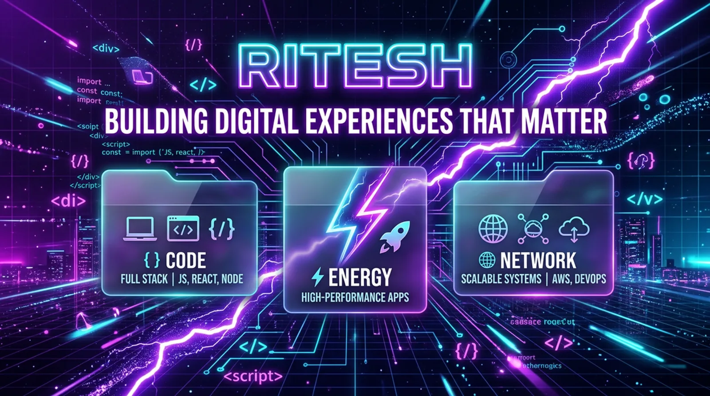

# ⚡ Ritesh — Interactive Portfolio & Features Lab

> **Not just a portfolio. A playground of ideas.**

[](https://github.com/riteshkumarmaurya42-bit/Ritesh/actions/workflows/ci.yml)
[](https://github.com/riteshkumarmaurya42-bit/Ritesh/actions/workflows/deploy.yml)
[](LICENSE)
[](CONTRIBUTING.md)

<p align="center">
  
</p>

A personal portfolio taken further: four hand-built feature pages — a browser
terminal, an arcade, a dev-tools hub, and a visual playground — plus PWA support
and a CLI resume. All in **vanilla JS with zero runtime dependencies** and no
build step.

**Live site:** https://riteshkumarmaurya42-bit.github.io/Ritesh/
**Try this:** press <kbd>Cmd</kbd>+<kbd>K</kbd> for the command palette, or
`↑ ↑ ↓ ↓ ← → ← → B A` for a surprise.

---

## ✨ What's inside

### 🎨 Core portfolio (`index.html`)
- **Particle-network background** — canvas physics with mouse repulsion
- **Custom cursor & magnetic buttons** — pointer devices only; touch users get native cursors
- **Glassmorphism UI** — blur, gradients, glow, typewriter, scroll reveals
- **Dark / light theme** — persisted in `localStorage`
- **Installable PWA** — service worker with offline fallback + app shortcuts
- **Accessibility** — skip link, keyboard navigation, `prefers-reduced-motion` support, ARIA landmarks

### 🧪 Features Lab (4 pages)

| Page | What it does |
| --- | --- |
| [`>_ Interactive Terminal`](features/terminal.html) | Linux-like terminal: `help`, `skills`, `cat secret.txt`, `cowsay`, `matrix`, `sudo hire-me`… |
| [🎮 Arcade Zone](features/games.html) | 3 canvas games from scratch: Neon Snake, Memory Matrix, Type Speed Demon |
| [🧰 Dev Tools Hub](features/tools.html) | 9 offline tools: QR, passwords, colors, JSON, Base64, Markdown, UUID/hash, regex, diff |
| [📊 Visual Playground](features/visuals.html) | Skills radar, commit graphs, contribution heatmap, fluid simulation, 3D tilt cards |

### 🤖 Extras
- **Demo assistant widget** — tiny offline keyword bot, honestly labeled as a demo
- **Command palette** — <kbd>Cmd</kbd>/<kbd>Ctrl</kbd>+<kbd>K</kbd>, fully keyboard-navigable
- **Konami code** — confetti + rainbow mode
- **CLI resume** — `node bin/ritesh-cli.js` (also `--json`, `--version`, `--help`)
- **Custom 404** — lost in space

---

## 🚀 Quick start

```bash
git clone https://github.com/riteshkumarmaurya42-bit/Ritesh.git
cd Ritesh

# Any static server works
npm start          # npx serve . -l 3000
# or: python3 -m http.server 3000

# Terminal resume
node bin/ritesh-cli.js

# Health checks (same ones CI runs)
npm run lint       # JS syntax, JSON, internal links, SW precache, manifest
npm test           # site-integrity + CLI test suite (node:test, no deps)
```

### npm scripts

| Script | What it does |
| --- | --- |
| `npm start` / `npm run dev` | Serve the site locally on :3000 |
| `npm run lint` | Dependency-free repo checks (`scripts/check.js`) |
| `npm test` | Node built-in test runner over `tests/` |
| `npm run icons` | Regenerate PWA PNG icons from scratch (`scripts/generate-icons.js`, no deps) |
| `npm run check` | lint + test in one go |

---

## 📁 Project structure

```
Ritesh/
├── index.html               # Portfolio home (hero, features, work, skills, contact)
├── features/
│   ├── terminal.html        # Browser terminal
│   ├── tools.html           # 9 offline dev tools
│   ├── games.html           # 3 canvas games
│   └── visuals.html         # Charts, fluid sim, tilt cards
├── css/style.css            # Design system + a11y utilities
├── js/
│   ├── main.js              # Theme, cursor, reveals, typewriter, toasts, easter eggs
│   ├── particles.js         # Particle-network background
│   ├── effects.js           # Command palette + confetti
│   └── ai-widget.js         # Demo assistant
├── bin/ritesh-cli.js        # Node CLI resume (--json / --version / --help)
├── scripts/
│   ├── check.js             # Lint: syntax, links, SW, manifest, quality gates
│   └── generate-icons.js    # Zero-dep PNG icon generator
├── tests/                   # node:test suites (site integrity + CLI)
├── data/projects.json       # Feature + project data (single source for tools)
├── .github/
│   ├── workflows/ci.yml     # Lint + test + served smoke test
│   └── workflows/deploy.yml # GitHub Pages deploy (lint → test → icons → deploy)
├── manifest.json            # PWA manifest (shortcuts, maskable icon)
├── sw.js                    # Service worker (network-first navigations)
├── 404.html                 # Custom 404
├── CHANGELOG.md
├── CONTRIBUTING.md
├── SECURITY.md
└── LICENSE                  # MIT
```

---

## 🎨 Make it yours

Forking this for your own portfolio? The main things to change:

| What | Where |
| --- | --- |
| Name, role, bio | `index.html`, `bin/ritesh-cli.js` (`info` object) |
| Email *(currently the `ritesh@example.com` placeholder — replace it!)* | `index.html`, `js/main.js`, `js/effects.js`, `bin/ritesh-cli.js`, `features/terminal.html`, `data/projects.json`, `package.json` — `npm run lint` will list every file still containing the placeholder |
| GitHub username / links | same files + `manifest.json` isn't username-specific |
| Projects & skills | `index.html` (work/skills sections), `data/projects.json` |
| Terminal commands & files | `features/terminal.html` (`files` and `commands` objects) |
| Colors & fonts | `css/style.css` (`:root` variables) |
| Site URL (canonical/OG tags) | each page's `<head>`, `robots.txt`, `sitemap.xml` |

CI will warn you (non-fatally) about leftover placeholder emails until you've
replaced them all.

---

## ⚙️ Tech notes & constraints

- **Zero runtime dependencies** — everything except the Visual Playground's
  Chart.js (CDN) is hand-rolled vanilla JS. No build step, no bundler.
- **Web APIs used** — Canvas, Clipboard, Crypto (UUID/SHA-256), IntersectionObserver,
  Service Worker, `localStorage`, Web Animations.
- **Performance** — throttled scroll handlers, particles pause on hidden tabs and
  scale with viewport, DPR capped at 2.
- **Accessibility** — skip link, `<main>` landmark, labeled controls, visible focus,
  toasts instead of `alert()`, full `prefers-reduced-motion` support.
- **The assistant is a demo** — it's keyword matching, not an LLM, and it's labeled that way.

---

## 🎮 Easter-egg checklist

- [ ] <kbd>Cmd</kbd>/<kbd>Ctrl</kbd>+<kbd>K</kbd> command palette
- [ ] Konami code: `↑ ↑ ↓ ↓ ← → ← → B A`
- [ ] `sudo hire-me` in the terminal
- [ ] `cat secret.txt` in the terminal
- [ ] Click any primary button for confetti
- [ ] Drag your mouse in the fluid simulation
- [ ] Beat the Snake high score
- [ ] Ask the assistant about the Konami code
- [ ] Try `rm -rf /` in the terminal (if you dare)
- [ ] Find the custom cursor

---

## 🤝 Contributing

This is a personal portfolio, but ideas and fixes are welcome — especially new
tools and games. See [CONTRIBUTING.md](CONTRIBUTING.md) for setup, conventions,
and the PR checklist. Good first ideas: a JWT decoder, an image compressor,
sound effects via Web Audio, a Three.js scene.

## 📬 Contact

I'm open to freelance and full-time work.

- GitHub: [@riteshkumarmaurya42-bit](https://github.com/riteshkumarmaurya42-bit)
- Portfolio: [live site](https://riteshkumarmaurya42-bit.github.io/Ritesh/)
- Or type `hire` in the CLI / `sudo hire-me` in the terminal 🙂

## 📜 License

[MIT](LICENSE) — use it, remix it, ship it. If it helps you, a ⭐ is appreciated.
